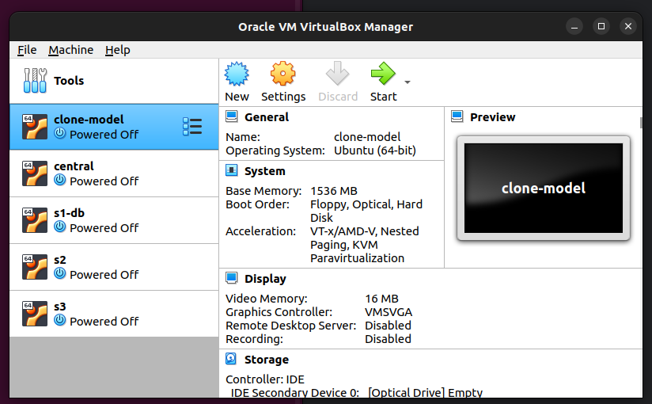

# ansible-lab
mini Lab deploiement ansible

Ansible est un outil puissant qui permet d’automatiser l’administration des serveurs notamment:
* **le système d’exploitation (OS)**
* **les applications**
* **la configuration réseau**

Ansible permet de gérer **l’infrastructure avec du code (IaaC)**

## Environnement du mini lab

* virtualiseur : **VirtualBox v6.1**\
* OS Guest: **Ubuntu Server 22.04 LTS**\
* Name Host Ansible Engine: **central**\
* Host: **s1-db, s2, s3**
* Username ansible: **user**
* Default ssh user: **user**
* Default ssh port: **2223**

* Ansible version: **ansible[core 2.16.3]**
> 
```
ansible --version
```
output
```
ansible [core 2.16.3]
  config file = None
  configured module search path = ['/home/user/.ansible/plugins/modules', '/usr/share/ansible/plugins/modules']
  ansible python module location = /home/user/.local/lib/python3.10/site-packages/ansible
  ansible collection location = /home/user/.ansible/collections:/usr/share/ansible/collections
  executable location = /home/user/.local/bin/ansible
  python version = 3.10.12 (main, Nov 20 2023, 15:14:05) [GCC 11.4.0] (/usr/bin/python3)
  jinja version = 3.0.3
  libyaml = True
```

## LAB 1- Installation et configuration de l'environnement

