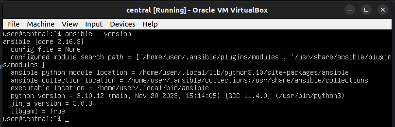

# ansible-lab
mini Lab deploiement ansible

Ansible est un outil puissant qui permet d’automatiser l’administration des serveurs notamment:
* **le système d’exploitation (OS)**
* **les applications**
* **la configuration réseau**

Ansible permet de gérer **l’infrastructure avec du code (IaaC)**

## Environnement du mini lab

* virtualiseur : **VirtualBox v6.1**\
* OS Guest: **Ubuntu Server 22.04 LTS**\
* Name Host Ansible Engine: **central**\
* Host: **s1-db, s2, s3**
* Username ansible: **user**
* Default ssh user: **user**
* Default ssh port: **2223**


* Ansible version: **ansible[core 2.16.3]**
```
ansible --version
```
> 

## LAB 1- Installation et configuration de l'environnement

En fonction de l’OS serveur installé pour les récentes versions (Ubuntu version 18.xx et + ), 
il y a déjà une version python v3.xx installée.

* Vérifier la version de python installée
```
python3 -V
```
> Python 3.10.12

* Installation de pip
```
curl https://bootstrap.pypa.io/get-pip.py -o get-pip.py
```
```
python3 get-pip.py
```
* Installation de ansible via pip
```
python3 -m pip install ansible
```
> [NOTE]
J’ai dû créer une machine virtuelle avec les dernières mise à jour sans y installer d'autres paquets particuliers. 
Ce VM sera cloner pour obtenir d’autres instances. Du coup on aura les mêmes instances basées sur le même système d’exploitation. 

Je vais juste changer le hostname générique s1 par le host pour facilement s’y retrouver

```
hostnamectl
```

Pour la machine ansible engine on va changer le host s1 par central
```
sudo hostnamectl set-hostname central
```

